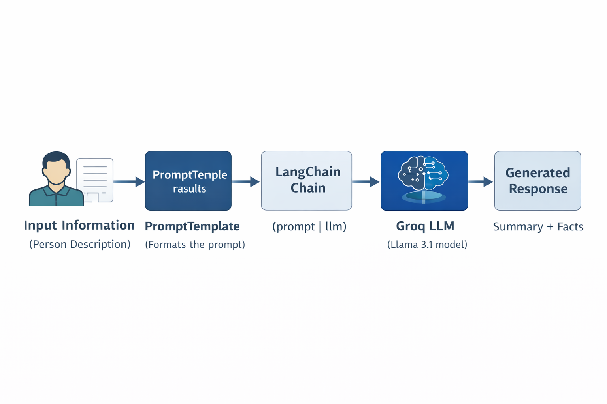

# 01 - LangChain Basic Chain

This example demonstrates a **basic LangChain pipeline** that sends structured prompts to a **Groq-hosted LLM** and generates a formatted response.

The program takes a short description of a person and asks the model to produce:

- A short summary
- Two interesting facts

This example introduces the **core building blocks of LangChain chains**.

---

# Workflow

The following diagram illustrates how the LangChain basic chain processes the input and generates the response.

<p align="center">
  
</p>

Execution steps:

1. **Input Information**  
   A block of text describing a person is provided.

2. **PromptTemplate**  
   The template formats the input into a structured prompt.

3. **LangChain Chain**  
   The prompt and LLM are connected using a LangChain chain.

4. **Groq LLM**  
   The formatted prompt is sent to the Groq-hosted model.

5. **Generated Response**  
   The model generates a summary and interesting facts.

---

# Libraries Used

## LangChain PromptTemplate

Library: `langchain_core.prompts`

`PromptTemplate` helps create **structured prompts** for language models.

Instead of manually formatting prompts using string concatenation, LangChain allows prompts to be defined using templates with variables.

Example:

```python
from langchain_core.prompts import PromptTemplate

prompt = PromptTemplate(
    input_variables=["information"],
    template=summary_template
)
```

This allows the same prompt structure to be reused with different inputs.

---

## LangChain Chains

LangChain allows developers to **connect components into pipelines called chains**.

In this example the chain connects:

```
PromptTemplate → LLM
```

This is implemented using the pipe operator:

```python
chain = prompt | llm
```

The chain automatically:

1. Formats the prompt
2. Sends it to the model
3. Returns the generated response

---

## Groq LLM Integration

Library: `langchain-groq`

This library connects **LangChain with Groq-hosted language models**.

Groq provides very fast inference for models such as:

- Llama 3
- Mixtral
- other open-source models

Example:

```python
from langchain_groq import ChatGroq

llm = ChatGroq(
    temperature=0,
    model="llama-3.1-8b-instant"
)
```

The model processes the prompt and generates the response.

---

# Setup

Create a `.env` file in the project root:

```
GROQ_API_KEY=your_api_key_here
LANGCHAIN_TRACING_V2=true
LANGCHAIN_PROJECT=langchain-basic
LANGCHAIN_ENDPOINT=https://api.smith.langchain.com
```

---

# Running the Example

From the project root run:

```bash
uv run 01_langchain_basic_chain/main.py
```

---

# Example Output

```
Summary:
Elon Musk is a technology entrepreneur known for founding SpaceX and leading Tesla.
He has significantly contributed to the advancement of electric vehicles, reusable rockets,
and artificial intelligence technologies.

Interesting Facts:
1. SpaceX developed reusable rockets, drastically reducing the cost of space travel.
2. Elon Musk founded Neuralink, which aims to connect the human brain with computers.
```

---

# Key Concepts Demonstrated

This example introduces the fundamental building blocks used in many LangChain applications:

- Prompt engineering with `PromptTemplate`
- Creating pipelines using **LangChain chains**
- Integrating **Groq-hosted LLMs**

These concepts form the **foundation for building more advanced LLM workflows and agents**.