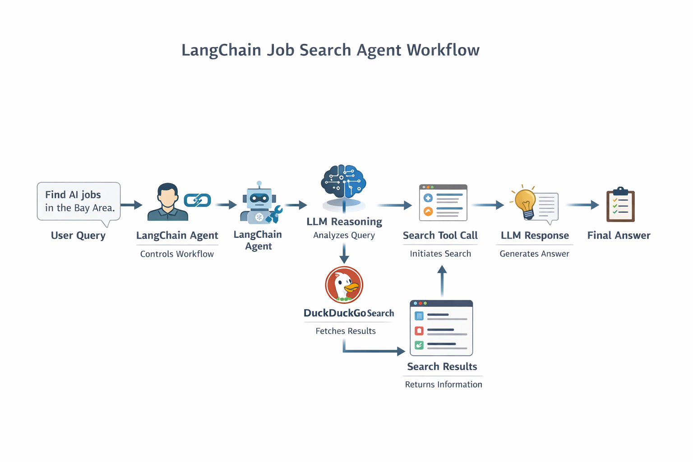

# LangChain Job Search Agent

This project demonstrates a simple **Agentic AI application** built using **LangChain**.

The agent searches the internet for **AI Engineer jobs related to LangChain** and summarizes the results using a **Groq LLM**.

To gather real-time information, the agent uses a **DuckDuckGo search tool**.

---

# Agent Architecture

The diagram below shows how the agent interacts with the LLM and the search tool.

<p align="center">
  
</p>

---

# Overview

The agent receives a user query such as:

```
Find 3 AI engineer jobs using LangChain in the Bay Area
```

The execution flow works as follows:

1. The **user submits a query**.
2. The **LangChain agent receives the request**.
3. The **LLM analyzes the query and decides if external information is needed**.
4. If required, the agent **calls the search tool**.
5. The search tool queries **DuckDuckGo**.
6. DuckDuckGo returns **search results**.
7. The results are sent back to the **LLM**.
8. The LLM **analyzes the results and generates a final response**.

This iterative reasoning pattern is known as the **ReAct (Reason + Act) Agent Pattern**.

---

# Libraries Used

## LangChain Tools

Library: `langchain_core.tools`

LangChain provides a **tool system** that allows Large Language Models to interact with external functionality such as:

- APIs
- search engines
- databases
- calculators
- file systems

In this project, a **search tool** is defined so the LLM can access internet search results when it needs additional information.

Example:

```python
from langchain_core.tools import tool

@tool
def search(query: str) -> str:
    """Search the internet for information"""
```

When the LLM determines that external information is required, it generates a **tool call**, and LangChain executes the corresponding Python function automatically.

This allows the model to **perform actions in addition to generating text**.

---

## DuckDuckGo Search (DDGS)

Library: `ddgs`

`ddgs` is a Python library that allows applications to perform **DuckDuckGo searches programmatically**.

Example usage:

```python
from ddgs import DDGS

with DDGS() as ddgs:
    results = ddgs.text("AI engineer jobs LangChain Bay Area", max_results=5)
```

The results typically contain:

- title
- link
- description

These search results are returned to the **LLM**, which analyzes them and generates a summarized response.

Unlike many search APIs, **DuckDuckGo does not require an API key**, making it convenient for learning and prototyping.

---

# Installation

This project uses **uv** for dependency management.

Install dependencies with:

```bash
uv add langchain langchain-groq ddgs python-dotenv
```

---

# Running the Agent

Run the agent with:

```bash
uv run jobsearch-agent/main.py
```

Example query handled by the agent:

```
Find 3 AI engineer jobs using LangChain in the Bay Area
```

---

# Example Output

```
Here are three AI Engineer jobs in the Bay Area:

1. AI Engineer – LangChain – San Francisco
2. AI Engineer – Hiya – San Francisco
3. AI Engineer – Ironclad – San Francisco
```

The agent may call the search tool **multiple times** to refine the results before generating the final answer.

---

# Key Idea

This project demonstrates how an **LLM can use external tools to gather real-time information** instead of relying only on its training data.

It is a simple example of an **Agentic AI system built using LangChain**.